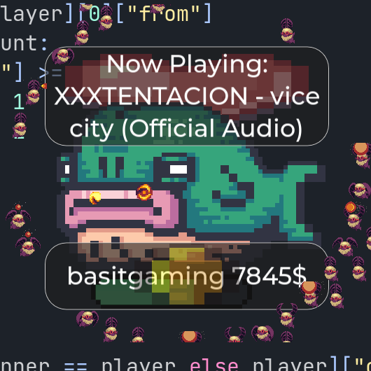

# Twitch Chatbot in Godot 🎮

An interactive Twitch Chatbot built using Godot and Python TwitchIO. Designed to enable various in-game commands and features. Styled to look like a cute desktop pet where you can interact with your followers.

<p align="center">
  
</p>


---

## 🌟 Features

### 🕹️ Player Registration

- Automatically registers players when they use a command for the first time.
- Players have coins, level, experience, items, and upgrades.

### 💰 In-game Currency

- Players earn and spend coins to perform various actions.
- Coins can be used to buy upgrades and items from the shop.

### 🛒 Shop and Upgrades

- Players can purchase various items and upgrades using coins.
- Items include "Maserati", "Adidas Esofman Takimi", "Kozmetik", etc.
- Upgrades enhance actions like "play", "heal", "attack".

### 📜 Commands

- `!sa`: Simple greeting command.
- `!attack`: Attacks a target, costing coins and having a cooldown.
- `!play`: Plays a song, earning coins.
- `!heal`: Heals a target, costing coins.
- `!stats`: Displays player stats.
- `!upgrade`: Buys an upgrade.
- `!buy`: Buys an item from the shop.
- `!res`: Resurrects the whale if it is dead.
- `!dice`: Challenges another player to a dice roll.
- `!accept`: Accepts a pending dice roll challenge.
- `!reisler`: Lists the top players.
- `!speak` & `!speakeng`: Placeholder for future development.

### 🏷️ Command Cost

- Commands have designated costs, requiring players to grind in the idle adventure game mode to earn enough coins.

### ⏲️ Cooldowns

- Commands like `!attack` and `!heal` have cooldown periods.

### 🌐 WebSocket Connection

- The bot uses WebSocket to interact in real-time with the Twitch chat and your channel.
- Enables seamless communication between Godot and Python.

### 🌟 Other Features

- Notifications for new messages and subscriptions.
- Visual popups and fade popups for in-game notifications.

---

## 🛠️ Installation

### Prerequisites

- Godot Engine
- Python 3.x
- Twitch account with developer access for API [tokens](https://twitchtokengenerator.com/) (OAuth Forward URL http://localhost:18297)

### Steps

1️⃣ **Clone the Repository**

    ```bash
    git clone alpapaydin/TwitchBotGodot
    ```

2️⃣ **Install Python Dependencies**

    ```bash
    pip install -r requirements.txt
    ```

3️⃣ **Open the Project in Godot**

4️⃣ **Configure Python Script**

    Update the .env file with your Twitch channel data:
    - Access Token
    - User ID
    - Channel Name
    - Discord Link

5️⃣ **Run the Python Script**

    ```bash
    python bot.py
    ```
    
6️⃣ **Run the Game in Godot**

---

## 🎮 Usage

To interact with the game, use the specified commands in the Twitch chat.

---

## 🤝 Contributions

Feel free to fork the project and submit a pull request.

---

## ⚙️ Configuration

For the chatbot to work properly, populate certain variables in the ".env":

```python
ACCESS_TOKEN = "Your Twitch API OAuth token"
USER_ID = "Your Twitch user ID"
CHANNEL_NAME = "The Twitch channel where the bot will operate"
DISCORD_LINK = "Your discord link for !dc command."
